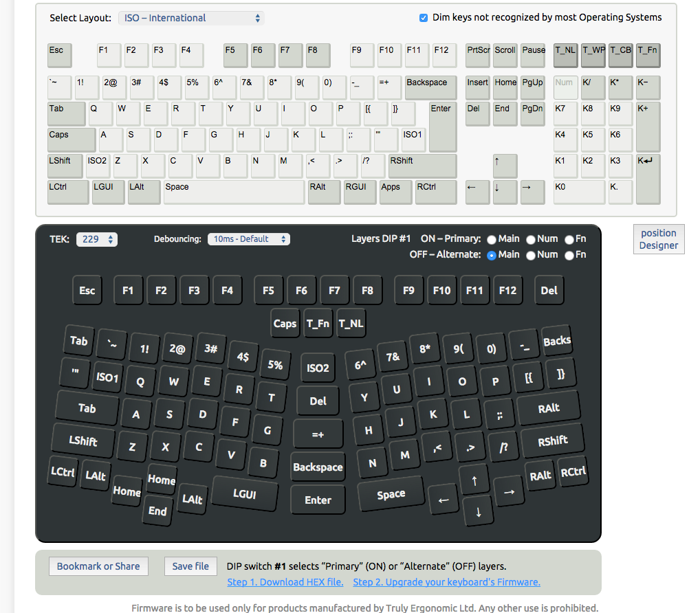

# Insallation
A popup opens when plugged in for the first time. The keyboard should be recognized as ISO.

# truly-ergonomic-macos-fr
My custom layout for the truly ergonomic 229 on OSX french AZERTY

## The layout

## Link to the layout
https://www.trulyergonomic.com/store/layout-designer--configurator--reprogrammable--truly-ergonomic-mechanical-keyboard/#KTo7PD0+P0BBQkNERUw5394rNR4fICEi5yMkJSYnLmQvMBQaCBUXTBwYDBITNDHgBBYHCQotCw0ODzPk4R0bBhkFKhEQNjc45ePiSktOTSwoLFBSUU/mZQAAAAAAAAAAAAAAAAAAAAAAAAAAAAAAAAAAX2BhAAAAAAAAAAAAAAAAXF1eVlcAAAAAAAAAAABZWltVAAAAAAAAAAAAYgBjVAAAAAAAAAAAWCsAAAAAAACTAQAMAiMBAAwBigEADAIhAQAMAZQBAAwBkgEADAGDAQAMALYBAAwAzQEADAC1AQAMAOIBAAwA6gEADADpAQAMALhJAEYAAAAAAEitR64AAAAAAAAAAAAAAAAAAAAAAAAAAAAAAAAAAAAAAAAAAAAAAAAAAAAAAAAAAAAAAAAAAAAAAAAAAAAAAAAAACk6Ozw9Pj9AQUJDREVMOd/eKzUeHyAhImQjJCUmJy0qNDIUGggVF0wcGAwSEy8wKwQWBwkKLgsNDg8z5uEdGwYZBSoREDY3OOXg4kpKTeLjKCxQUlFP5uQAAAAAAAAAAAAAAAAAAAAAAAAAAAAAAAAAAF9gYQAAAAAAAAAAAAAAAFxdXlZXAAAAAAAAAAAAWVpbVQAAAAAAAAAAAGIAY1QAAAAAAAAAAFgrAAAAAAAAkwEADAIjAQAMAYoBAAwCIQEADAGUAQAMAZIBAAwBgwEADAC2AQAMAM0BAAwAtQEADADiAQAMAOoBAAwA6QEADAC4SQBGAAAAAABIrUeuAAAAAAAAAAAAAAAAAAAAAAAAAAAAAAAAAAAAAAAAAAAAAAAAAAAAAAAAAAAAAAAAAAAAAAAAAAAAAAAAAAA=
